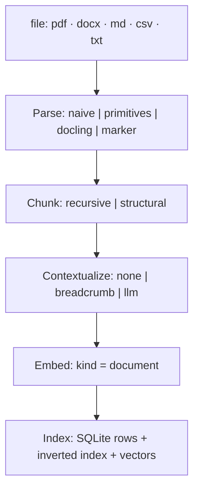
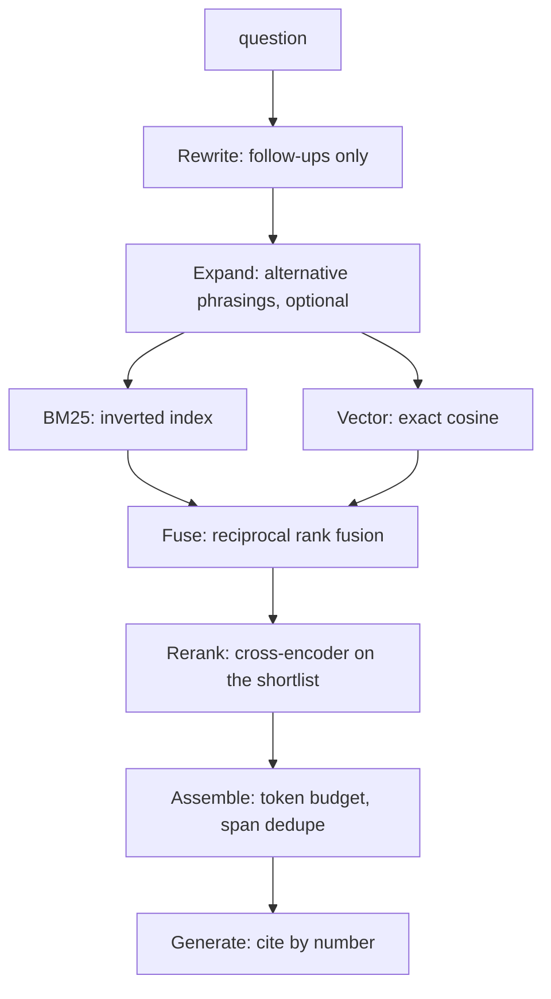
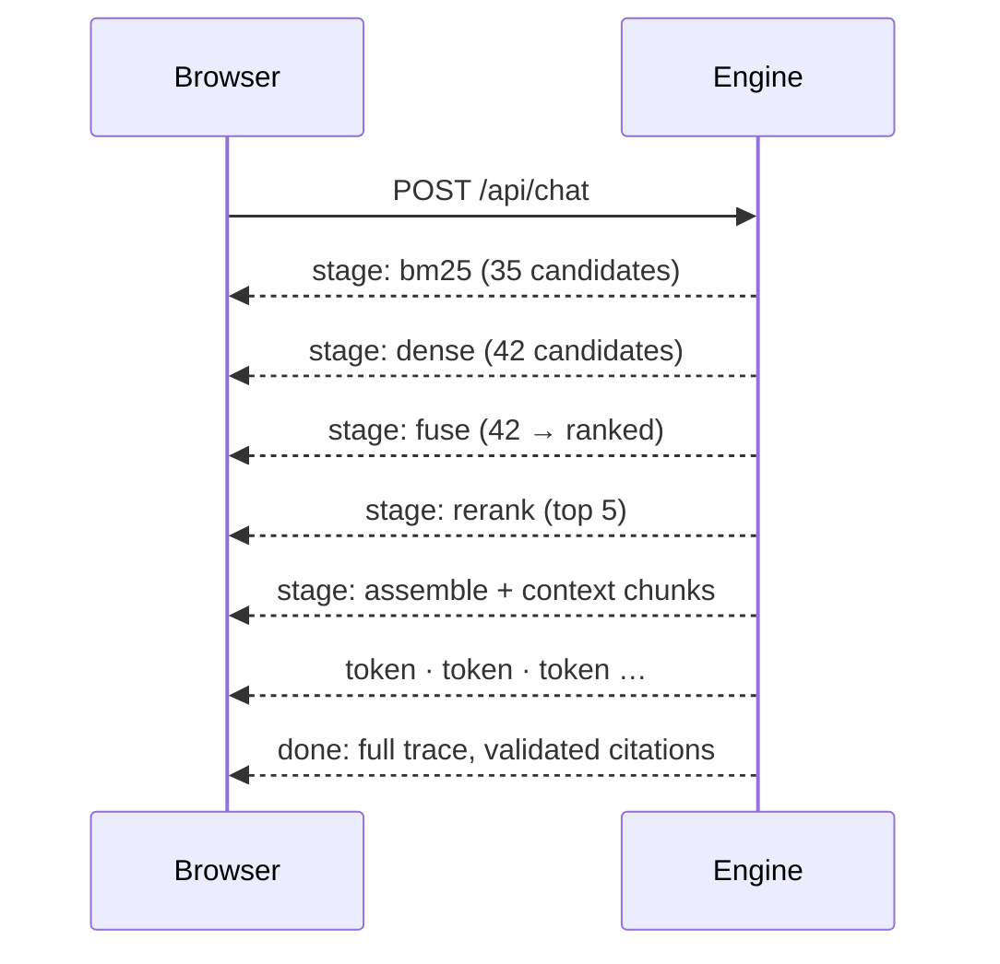
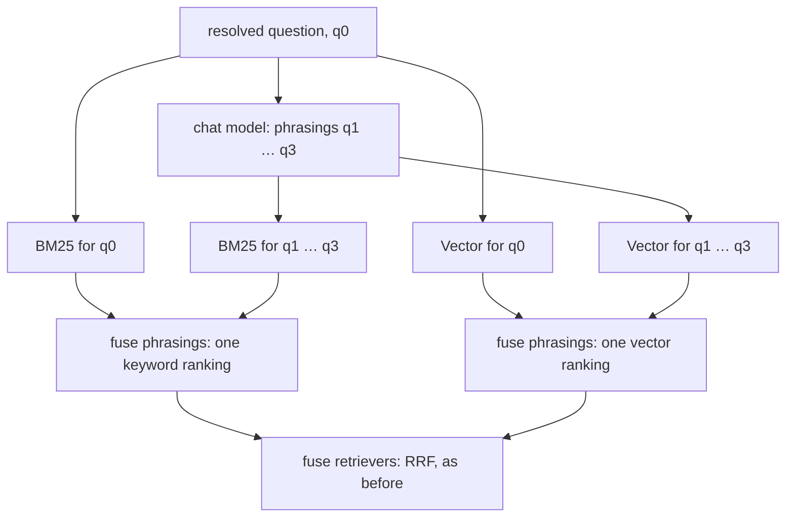

Most RAG applications show you a spinner and then an answer. When the answer is
wrong you cannot tell whether the retriever never found the right passage or the
model ignored it, and "I built a RAG pipeline" is not a claim anyone can check.
clear-rag is the successor to my 2024 [Local RAG
System](https://github.com/hvenry/Local-RAG-System), built around two things
that project lacked: the retrieval process is **visible** as it happens, and
every technique in the pipeline has a **measured** effect on retrieval quality.

The retrieval core is written from primitives. BM25 over a hand-built inverted
index, reciprocal rank fusion, context assembly, and a geometric PDF layout
parser are all written from the formula rather than imported. Libraries are used
where they teach nothing (HTTP, SQLite, tensor math) and avoided where they
would hide the thing worth understanding. Everything runs on one machine against
Ollama, with no credentials required.

## Two pipelines



Ingestion is content-hashed, so re-uploading an unchanged file costs nothing.
Every chunk records the **character span** it occupies in the source document.
That one invariant is what makes exact citation highlighting and span-anchored
evaluation possible later on.



Keyword and vector search run concurrently. Fusion produces a shortlist, the
reranker re-scores it, assembly packs the survivors into the token budget, and
only then does generation begin.

## Streaming the machinery

The chat endpoint streams Server-Sent Events, and it streams **stage events**
alongside answer tokens. The browser sees keyword search finish, vector search
finish, fusion reorder the candidates, and the reranker move things again,
before a single word of the answer arrives.



The design decision everything rests on is that every retrieval stage consumes
and produces the same type:

```python
@dataclass(frozen=True)
class Candidate:
    chunk_id: str
    score: float
    rank: int
    source: str  # "bm25" | "dense" | "rrf" | "rerank"
```

Because keyword search, vector search, fusion and reranking all speak
`list[Candidate]`, the interface can draw a rank-flow diagram between _any_ two
adjacent stages without knowing what those stages do. A technique added later
appears in the visualisation for free. The trace is a **returned value, not a
log**: each query returns `(answer, trace)`, so it also persists to SQLite and
the evaluation harness can replay it offline without touching a model.

## The retrieval core

### Keyword search

BM25 is implemented from the formula over an inverted index that maps every term
to the chunks containing it, so a query only touches chunks sharing at least one
word with it. For a query $Q$ and chunk $D$:

$$
\mathrm{idf}(q) = \ln\!\left(1 + \frac{N - \mathrm{df}(q) + 0.5}{\mathrm{df}(q) + 0.5}\right)
$$

$$
\mathrm{score}(D, Q) = \sum_{q \in Q} \mathrm{idf}(q) \cdot
\frac{f(q, D)\,(k_1 + 1)}{f(q, D) + k_1\left(1 - b + b\,\frac{|D|}{\mathrm{avgdl}}\right)}
$$

with $k_1 = 1.2$ and $b = 0.75$, chosen to match SQLite FTS5's defaults. That
choice is deliberate: a from-scratch ranking function is easy to write plausibly
and hard to verify by reading, so a **differential test** indexes the same
corpus into FTS5 and asserts both implementations agree on the ranking.

### Vector search

Every vector is L2-normalised on the way in, so an inner product _is_ cosine
similarity and the search over the whole corpus is one matrix-vector product:

$$
\hat{v} = \frac{v}{\lVert v \rVert_2}, \qquad
\mathrm{sim}(q, d) = \hat{q} \cdot \hat{d}
$$

The index is exact rather than approximate. Under about 100k chunks exhaustive
cosine is single-digit milliseconds and has no parameters to misconfigure.
Swapping in an approximate index is deferred on purpose, so that it arrives as a
measured experiment in recall against latency rather than an unexamined
default. Embedding models are also asymmetric: nomic-embed-text expects
different prefixes for queries and passages, and encoding both the same way
silently costs recall. The `kind="document" | "query"` distinction is part of
the provider's type signature so the mistake is unrepresentable.

### Fusion

The two rankings cannot be combined by score. BM25 scores are unbounded sums of
idf terms and cosine lives in $[-1, 1]$, so any weighting of raw scores needs
per-corpus tuning that rots as the corpus changes. Reciprocal Rank Fusion
consumes only rank positions:

$$
\mathrm{RRF}(d) = \sum_{r \in \text{retrievers}} \frac{1}{k + \mathrm{rank}_r(d)},
\qquad k = 60
$$

A chunk both searches liked beats a chunk only one search ranked first. Every
fused candidate records its per-retriever contribution, which is the data behind
the rank-flow chart. Without it the interface could show _that_ a document
moved but not _why_. A min-max weighted alternative exists so the ablation table
has something to compare RRF against:

$$
s(d) = \sum_{r} w_r \cdot \frac{s_r(d) - \min s_r}{\max s_r - \min s_r}
$$

### Reranking

The embedding model is a bi-encoder: it reads query and chunk separately and
compares summaries. A cross-encoder reads them together through one transformer
and scores their interaction. That is far more accurate, and far too slow for a corpus. So
the cheap retrievers propose about fifty candidates and ms-marco-MiniLM-L-6-v2,
quantised to 23 MB of ONNX, re-scores only that shortlist on CPU. Its logits
are mapped through $\sigma(z) = 1 / (1 + e^{-z})$ for display; the ordering is
identical either way.

## Measuring it

Relevance labels are anchored to **character spans** in source documents, never
to chunk ids. Chunk ids change whenever chunking configuration changes, and
comparing chunking strategies is the point, so id-anchored labels would
invalidate themselves the first time they were useful. Labels are written as
quotes and resolved to spans at load time; a quote that matches nothing, or
matches twice, is a hard error.

A retrieved chunk $c$ counts as covering a labelled span $\ell$ when it holds at
least half of it:

$$
\frac{|c \cap \ell|}{|\ell|} \ge 0.5
$$

recall@$k$ is then the fraction of labelled spans covered by the top $k$, which
keeps the denominator fixed no matter how the corpus is cut. MRR and nDCG use
binary gains:

$$
\mathrm{MRR} = \frac{1}{|Q|}\sum_{q} \frac{1}{\mathrm{rank}_q},
\qquad
\mathrm{nDCG}@k = \frac{\sum_{i=1}^{k} \mathrm{rel}_i / \log_2(i+1)}
                       {\sum_{i=1}^{\min(k, R)} 1 / \log_2(i+1)}
$$

An ablation runner sweeps configurations over a 67-question golden set and a
ten-document corpus, using nomic-embed-text through Ollama. Each row isolates
one decision, walking from where the 2024 project stood to the current pipeline:

| Configuration                    | recall@1  | recall@5 | MRR       | nDCG@5 |
| -------------------------------- | --------- | -------- | --------- | ------ |
| dense only, 50% overlap (2024)   | 0.589     | 0.903    | 0.708     | 0.765  |
| dense only                       | 0.573     | 0.871    | 0.691     | 0.745  |
| keyword only (BM25)              | 0.766     | 0.903    | 0.823     | 0.843  |
| hybrid + RRF                     | 0.734     | 0.968    | 0.841     | 0.874  |
| **hybrid + RRF + cross-encoder** | **0.927** | 1.000    | **0.965** | 0.974  |

Two techniques carry the table. Hybrid retrieval gets the right chunk into the
top five for all but two questions, resolving distractor questions that either
method alone got wrong. Reranking then puts it first, and recovers the two.
Notably BM25 beats vector search here: on a technical corpus full of
identifiers like `X-RateLimit-Remaining`, lexical matching is genuinely strong,
which is the argument against the dense-only pipeline the predecessor used.

The table is not typed by hand. `clear-rag ablate --save-results` writes one
JSON file per suite, with every row carrying the models and date that measured
it; the README tables are rendered from those files and CI fails if a table was
edited or if a number in prose no longer appears in any of them. The app reads
the same files in a Results view: pin a row and every other row is read against
it, with the settings that differ and how far each metric moved, then open the
questions behind the move. That is the visible half of the "measured" claim.

Three caveats, because a table without them is a sales pitch. recall@5 sits at
or near 1.000 for every hybrid row and stops discriminating, so recall@1 and MRR
do the work. Weighted fusion edging RRF at recall@1 is three questions out of
62, inside noise. And chunk size barely moves any metric between 192 and 1024
tokens, which is itself a finding: retrieval is not sensitive to chunk size when
each document covers a distinct topic. The nine paraphrase questions, worded to
share almost no vocabulary with their answers, are the exception: at 96 tokens
they fall to 0.444.

## Query expansion

A question and the passage that answers it are often written in different
registers. "Can a customer be relocated to a different data centre?" is
answered by a paragraph about _moving a tenant between regions_, and the two
share no useful word. Keyword search is blind to that by construction, and
vector search is only as good as the embedding model's sense that the two mean
the same thing. The nine `paraphrase` questions are written this way on
purpose, so that anything built to fix the problem has something to measure
against before it is built.

Multi-query expansion is the first technique built for it. The chat model is
asked for three alternative phrasings of the resolved question, told to prefer
the vocabulary a technical document would use, and every phrasing is searched.
The lesson from the predecessor's rewrite bug applies here too: the model is
told not to answer, only to rephrase, and what it wrote is shown in the chat
under "also searched as", so a bad expansion is visible rather than silent.



Fusion happens in two levels rather than one flat merge. Each retriever first
fuses its own rankings across the phrasings by reciprocal rank, and only then
do the two retrievers fuse:

$$
s_r(d) = \sum_{i=0}^{n} \frac{1}{k + \mathrm{rank}_{r,i}(d)},
\qquad
\mathrm{RRF}(d) = \sum_{r} \frac{1}{k + \mathrm{rank}_r(d)}
$$

where $\mathrm{rank}_{r,i}$ is the position retriever $r$ gave chunk $d$ for
phrasing $i$, and $\mathrm{rank}_r$ is the chunk's position in that retriever's
fused list. A flat fusion over every retriever-and-phrasing pair would score
the same chunks, but it would leave the interface with no single keyword or
vector ranking to draw, and "which search found this" is the one question the
inspector must always be able to answer. Two levels keep every stage speaking
one `list[Candidate]`.

Measured against the table above, on hybrid + RRF it does its job: the
paraphrase column goes from 0.778 to 1.000, and both questions fusion had
missed outright come back at ranks three and four. It also has a bill. recall@1
falls from 0.734 to 0.653 and MRR from 0.841 to 0.802, because the phrasings
pull in near-misses that rank fusion then promotes over the exact hit: the
first relevant chunk moved up on ten questions and down on fourteen. Each
question costs almost four seconds of a 9B model writing phrasings, against
half a second for the reranker. And stacked on the reranker it changes nothing
at all, for a structural reason: at 512 tokens this corpus is eleven chunks and
each search returns fifty candidates, so the shortlist is the corpus and the
cross-encoder decides the order alone. Expansion can only change what enters
the shortlist, and here nothing is ever left out. On this benchmark the
reranker is the better buy, the knob stays off by default, and the case
expansion was built for, a corpus large enough that the shortlist is a real
cut, is one this benchmark cannot yet make.

### HyDE, and why it is still greyed out

Hypothetical document embeddings take the register problem from the other
side. Instead of rephrasing the question, the model is asked to _answer_ it
from imagination; that hypothetical answer is embedded, and its vector, not the
question's, is what searches the corpus. The logic is that a made-up answer is
written in the register of real answers, so it lands nearer to them in
embedding space than a question ever could. The configuration has carried a
`hyde` option since the first version, and the Lab shows it disabled rather
than pretending.

It is the last of the query techniques I will build, because it is the
predecessor's bug made deliberate. That project's rewrite prompt answered the
question instead of rephrasing it, and from the second turn onward the index
was searched with a hallucinated answer. HyDE only pays off when the
hallucination lands in the right vocabulary; with a local 3B or 9B model, a
confident wrong answer that then searches for itself is the likelier outcome.
The paraphrase column now exists to settle that with a number, alongside
decomposition of compound questions against the SEC corpus's cross-company
set. Each will arrive as a row in the table, or not at all.

## What recall cannot see

Retrieval metrics only say whether the right text was retrieved. Indexing a
one-page résumé at 512 tokens produces three chunks, so with five chunks to the
model every query retrieves the entire document and recall is trivially perfect.
Asked what I did at one club, a 3B model still refused: the answer sat at
character 2897 inside a 2,092-character chunk holding a job, a degree and two
other clubs. At 192 tokens the same model, same document, answered correctly.
Larger chunks were not a retrieval problem, they were an **attribution**
problem, and no recall@k would ever have shown it.

So a second suite grades the answers themselves, deterministically, with no
judge model: false refusals, required mentions and wrong-section bleed, and
whether the cited chunks actually cover the labelled span. Its corpus is a single
fictional staff profile whose sections deliberately share vocabulary, so
retrieval is perfect in every configuration and every failure is a generation
failure:

| Model · chunk size | required mentions | grounding | citation precision |
| ------------------ | ----------------- | --------- | ------------------ |
| qwen3.5:9b · 512   | 1.000             | 1.000     | 1.000              |
| llama3.2:3b · 512  | 0.750             | 0.333     | 0.333              |
| llama3.2:3b · 192  | 0.750             | 0.500     | 0.458              |

The 3B model _says_ the right thing three times in four while citing the wrong
chunk two times in three. Past a modest floor, attribution quality is a
property of the model far more than of the chunking, and it is invisible to
recall.

## Parsing as a variable

A PDF contains no paragraphs, headings or tables, only positioned glyphs and
drawn lines. The `primitives` backend infers columns, headings, header and
footer furniture, and ruled or aligned tables from pdfplumber word geometry in
about 600 lines, and emits typed blocks that structural chunking cuts along.
docling and marker are wired as optional ML backends. To score them, a corpus
of Apple and Microsoft 10-K sections was rendered to PDF from the SEC's HTML,
with the tag-stripped HTML kept as parse ground truth:

| Configuration                  | recall@1 | recall@5 | table |
| ------------------------------ | -------- | -------- | ----- |
| naive parser (pypdf)           | 0.538    | 0.872    | 0.636 |
| primitives parser              | 0.436    | 0.846    | 0.545 |
| docling parser                 | 0.385    | 0.718    | 0.455 |
| primitives + semantic chunking | 0.410    | 0.692    | 0.182 |

None of these are the marketing version. Flat extraction wins on born-digital
renders, and the hand-rolled parser beats docling's layout models on both word
recovery and retrieval. Semantic chunking _regresses_ financial tables, because
heading-bounded packing folds a statement into one large mixed chunk. Contextual
retrieval measured a null on a corpus whose two companies were never ambiguous
enough to need it. The differential parse test also caught two real bugs during
development, worth 0.78 to 0.99 in reading-order fidelity.

## Testing without models

Tests run entirely on fake providers: a deterministic bag-of-words hash embedder
and a scripted chat model. That is the one piece of infrastructure that makes a
RAG project testable, and it is why this one has about 240 tests where most RAG
repositories have none. The fake embedder is not random, so retrieval tests
assert real ranking behaviour. The same golden set runs through the real
pipeline in CI and compares against a committed baseline, which catches a change
that silently breaks chunking, BM25, fusion or assembly. Making that gate
trustworthy required a fix: chunk ids were random UUIDs, and because BM25 and
RRF break ties on chunk id, two runs over identical input produced different
metrics. Ids are now derived from document and position.

## What the predecessor got wrong

Building this made three real bugs in the 2024 project legible.

| Bug                                                               | Consequence                                                      |
| ----------------------------------------------------------------- | ---------------------------------------------------------------- |
| The history-aware rewrite prompt said _"provide a response…"_     | From turn two, the index was searched with a hallucinated answer |
| Document vectors were normalised by hand; query vectors were not  | Reported similarity scores were meaningless                      |
| Answer quality was scored as cosine similarity to its own context | Rewarded copying and penalised a correct "I don't know"          |

Each fix lives beside a comment naming the original mistake, and two have
regression tests. The index was also rebuilt from scratch on every launch, and
chunk overlap was 50%, which doubled the index and filled top-k with
near-duplicates of one passage.

## Where it stops

The interface exposes HyDE and self-correction as knobs, greyed out with a
note, because the configuration model advertises them and the machinery does not
exist yet. The vector index is exact, so nothing here has
been measured past a few thousand chunks. The benchmark corpora are small enough
that recall@5 saturates, and the marker parser's ablation row is pending a GPU
path. It runs for one person on one machine: no auth, no multi-user, no OCR for
scanned PDFs beyond a pointer to `ocrmypdf`.

## Background

The 2024 version answered "can I build a RAG pipeline?" with LangChain, FAISS
and a conversational retrieval chain, and grew out of an earlier caselaw system
on Harvard's Caselaw Access Project using the OpenAI API and Pinecone. This one
asks "how well does it actually retrieve, and how would I know?" It puts the
evaluation harness ahead of the features, so every change since has arrived
with a before-and-after number rather than a claim.
