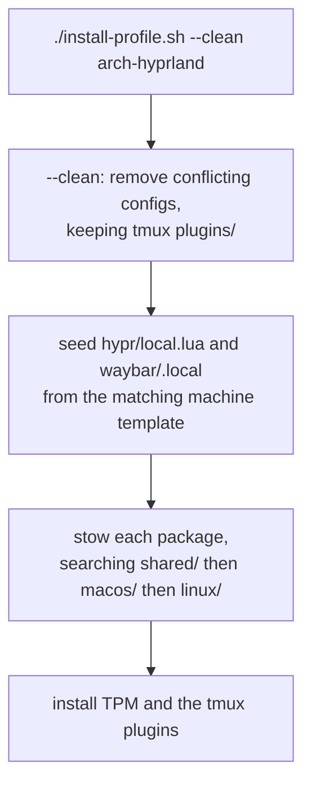
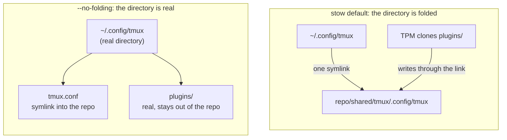

Symlinking a config file into place is a solved problem, and [GNU Stow](https://www.gnu.org/software/stow/) solves it in one command. The difficulty starts at the second machine. This repository provisions two of them, a macOS laptop and an Arch Linux desktop running [Hyprland](https://hypr.land/), and nearly everything in it exists to handle some kind of difference that a symlink cannot express on its own.

There turned out to be three kinds, and they need three different answers.

## Difference by platform

This one is structural, and it is the easy case. Each of the 23 stow packages lives under exactly one of `shared/`, `macos/`, or `linux/`, so a checkout tells you at a glance what applies where. A profile is then a plain list of package names with no platform prefix, and the installer resolves each name by searching the three directories in order, first hit wins.

That indirection is what keeps the profiles readable. `macos.txt` can name `nvim` and `aerospace` on adjacent lines without caring that one is shared and the other is not.

| Profile         | What it sets up                                                            |
| --------------- | -------------------------------------------------------------------------- |
| `macos`         | Shell, editor, multiplexer, terminal, plus AeroSpace and Rectangle         |
| `arch-hyprland` | The same core, plus the full Wayland desktop: Hyprland, Waybar, Rofi, Mako |
| `server`        | Zsh, Neovim, and tmux only, for headless boxes                             |

The shared core is [Zsh](https://www.zsh.org/), [Neovim](https://neovim.io/) configured in Lua through lazy.nvim, [tmux](https://github.com/tmux/tmux/wiki) on a `ctrl+space` prefix, and [Ghostty](https://ghostty.org/) as the terminal on both platforms. The piece that matters most day to day is [vim-tmux-navigator](https://github.com/christoomey/vim-tmux-navigator), because it makes `ctrl+hjkl` cross between Neovim splits and tmux panes as though they were one surface.

macOS is the interesting half here only because its window manager cannot be replaced, so the config works with it instead. [AeroSpace](https://github.com/nikitabobko/AeroSpace) drives i3-style workspaces from a versioned TOML file and floats every window on purpose, which leaves the actual snapping to [Rectangle](https://rectangleapp.com/).

## Difference by machine

Platform is not the only axis, and the second one is harder because it cannot be committed at all. The laptop and the desktop both run Hyprland, but their monitor names, resolutions, and workspace assignments differ, so there is no single correct value to check in.

The answer is a template directory. `machines/laptop.lua` and `machines/desktop.lua` are tracked, and the file Hyprland actually reads, `local.lua`, is gitignored. Hyprland's main config does `pcall(require, "local")` at the top, so a missing local file degrades rather than crashes.

Which leaves the question of how `local.lua` appears on a fresh clone. The installer picks a template by looking for one named after the hostname, then falling back to `hostnamectl chassis`, then to a glob for `/sys/class/power_supply/BAT*`, and finally defaulting to desktop. It never overwrites an existing local file, because those are hand-tuned against real hardware.

The ordering is the part I got wrong the first time. Seeding has to run **before** stow, not after, so that the newly created file gets linked in the same pass. Run it afterwards and stow has already decided there was nothing there to link.

## Difference that is not a file at all

The third kind is everything a symlink cannot reach: installed packages, enabled services, cloned plugin repositories, imported signing keys. That is what the bootstrap scripts are for. On Arch, `arch-install.sh` installs 73 pacman packages and 10 AUR packages, sets up Ly as the display manager, then hands off to the profile installer.

Two details in there took real debugging. The first is that `makepkg` and `yay` refuse to run as root, so a script invoked with `sudo` has to drop back down to the invoking user for every AUR step. It does that through a `run_as_user` helper that re-enters as `$SUDO_USER` with a corrected `HOME`, and it fails loudly up front when there is no such user, rather than halfway through an install.

The second is subtler. `yay --noconfirm` cannot prompt you to accept an unknown GPG key, so a package that verifies its sources fails with "unknown public key" and, under `set -e`, takes the whole script down with it. The fix is to import those keys before anything builds, which keeps an unattended install actually unattended.

## Everything here fails silently

The bugs in this repository share a shape, and noticing that changed how I write the scripts. None of them produce an error. The config is present and syntactically fine, and something that should have been linked or installed simply is not.

`tmux.conf` ends with `run '~/.config/tmux/plugins/tpm/tpm'`. With TPM absent that line fails quietly, and because keybindings are plain config they keep working, so the session looks correct and only the theme and plugins are missing. TPM is deliberately untracked, since vendoring it would mean a nested git repository, so every fresh clone hits this. Bootstrapping it in the installer is the only reason it is not a permanent footgun.

## Folding, and why it is off

`.stowrc` sets `--no-folding`, and that single flag shapes more of this repo than anything else in it.

By default stow folds: if a target directory does not exist yet, it creates one symlink pointing at the whole directory in the repo. That is tidy right up until something else needs to write into that directory. TPM installing plugins into `~/.config/tmux/plugins` would be writing straight into the repository through the link.

With folding off, every directory is created for real and each file is linked individually, so untracked things can live beside tracked ones.

The cost is real and I pay it regularly. Because files are linked one at a time, **pulling a commit that adds a new file creates no symlink for it**. The change is in the repo, the old files still point at the right place, and the new ones simply are not there. I hit this recently after adding a few Neovim plugin files: everything already linked picked up its changes instantly, and the five new files were invisible until I re-ran stow.

## Hyprland in Lua

Hyprland moved its configuration to Lua in 0.55, but the migration is only half done upstream: `hyprlock` and `hyprpaper` still read the old hyprlang format. That is why each machine needs a template _pair_, a `.lua` file for monitors and workspace rules and a `.conf` file for the wallpaper paths those two tools want.

The part worth knowing is that `hyprctl reload` cannot switch config formats. A session that started from the old setup stays on hyprlang and ignores `hyprland.lua` entirely, so the reload appears to succeed and changes nothing. You have to log out and back in. `hyprctl systeminfo | grep configProvider` tells you which one you are actually on.

## Where it stops

The re-stow requirement above is the sharpest edge, and it is the one I would fix first. A wrapper that re-stows every installed package after a pull would remove the failure mode completely.

Two smaller gaps are known. VS Code stows to `~/.config/Code/User/`, correct on Linux and wrong on macOS, where it reads from `~/Library/Application Support/Code/User/`. And Rectangle cannot read a dotfile at all, since its source of truth is a macOS preferences plist, so the repo versions an exported JSON snapshot that has to be re-exported by hand. That is exactly the kind of manual step the rest of the repo exists to eliminate.

## Background

It started flat, with every package at the repository root. That was fine with one machine and became actively misleading with two: a fresh Mac checkout showed thirteen Hyprland directories it would never use. Splitting by platform turned a boundary I had been keeping in my head into one the directory structure enforces.
