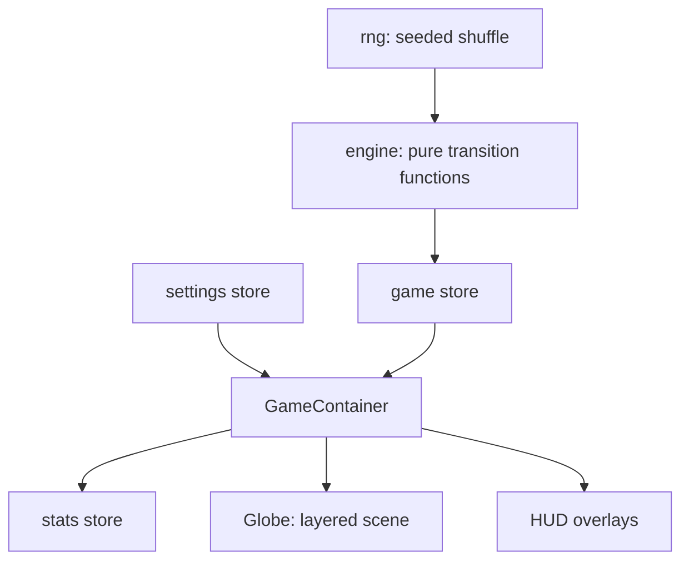

A geography quiz built as an instrument panel around a 3D globe: you get a
country name and have to find it, 195 of them. The interesting problem is not
the quiz. It is that country borders are flat GeoJSON polygons and a globe is
a sphere, so every fill, every border, and every click has to cross between the
two representations without drifting.

## Game modes

The ruleset is composed from a handful of independent settings rather than a
fixed list of difficulties, so the game scales from a relaxed study tool to
something genuinely punishing.

| Setting     | Options                         | Effect                                                   |
| ----------- | ------------------------------- | -------------------------------------------------------- |
| Country set | World, or one of six continents | Restricts the pool; out-of-set countries dim to 10%      |
| Attempts    | 1–5 per country                 | Also the scoring denominator                             |
| Timer       | Off, 5s, 10s, 15s, 30s          | Per country, not per run                                 |
| Hints       | On / off                        | A wrong click names the country you actually hit         |
| Skips       | On / off                        | Arrow keys move through the queue, preserving each timer |

### Standard mode

Wrong guesses fill red and the country stays live until you find it or run out.
When attempts or time expire, the round does not simply move on. It enters a
`mustclick` state where the country is revealed and you have to click it before
anything advances. Getting it wrong still teaches you where it was, which
matters more than the score.

### Expert mode

One wrong click ends the run. The timer locks to five seconds, hints and skips
are disabled, attempts drop to one, and the camera flies to whatever you missed
so the run ends on the answer. Because it is a different game, it keeps its own
best-score records and swaps the interface to a gold channel.

Expert mode is a single switch in the settings store: it saves your existing
preferences, overwrites them with the locked ruleset, and restores them on the
way out, so there is no second code path to keep in sync.

### Scoring

A country is worth the fraction of its attempts you did not spend, so a
first-try find is worth a full point and each miss erodes it. Across a set of
$N$ countries with $T$ attempts allowed and $t_i$ remaining when country $i$
resolved:

$$
S = \frac{1}{N}\sum_{i=1}^{N} \frac{t_i}{T}
$$

Timing out scores zero for that country but does not end the run.

## From flat geometry to a sphere

Country shapes arrive as Natural Earth TopoJSON, decoded to GeoJSON rings of
longitude/latitude pairs. Three different things have to happen to that data,
and each needs its own conversion.

### Painting fills

Fills are not geometry. Every country is drawn with a d3 `geoPath` onto a
4096×2048 canvas, which is uploaded as a texture and wrapped on a sphere. The
projection is equirectangular, scaled so the canvas spans exactly one full turn
of longitude, and rotated a quarter turn so that its origin lines up with the
axis the border meshes use. For longitude $\lambda$ and latitude $\varphi$ in
degrees, a point lands at texture coordinates:

$$
u = \frac{1}{2} + \frac{\lambda - 90^\circ}{360^\circ},
\qquad
v = \frac{1}{2} - \frac{\varphi}{180^\circ}
$$

That is a plate carrée, which is the one projection whose $(u, v)$ happens to
be exactly the UV parametrisation of a sphere, which is why the texture can be
wrapped with no resampling. Painting into 2D also means a fill costs one canvas
operation instead of a tessellated mesh, and the layer only repaints when its
own state changes.

### Placing points in 3D

Borders, markers and camera targets need real positions. The sphere is oriented
with $[\lambda, \varphi] = [0, 0]$ on the $+X$ axis, giving a polar angle
$\theta$ measured from $+Y$ and an azimuth $\psi$:

$$
\theta = \frac{\pi}{180}\left(90^\circ - \varphi\right), \qquad
\psi = \frac{\pi}{180}\left(90^\circ - \lambda\right)
$$

$$
\mathbf{p} = r\left(\sin\theta\cos\psi,\ \cos\theta,\ \sin\theta\sin\psi\right)
$$

### Reading a click back

Picking runs the same map backwards. A ray from the pointer hits an invisible
sphere, and that intersection is inverted to coordinates:

$$
\varphi = 90^\circ - \frac{180^\circ}{\pi}\arccos\!\left(\frac{p_y}{r}\right),
\qquad
\lambda = 90^\circ - \frac{180^\circ}{\pi}\operatorname{atan2}(p_z, p_x)
$$

with $\lambda$ wrapped back into $[-180^\circ, 180^\circ]$. Testing that point
against 195 polygons per frame would be far too slow, so it goes through a
precomputed index: micro-state centroids first, taking the closest within a tap
radius, then a bounding-box test to reject almost everything before any real
point-in-polygon work. Both forward and inverse conversions live in one module,
because two copies that disagree by a sign is a bug you find only at the poles.

## Architecture

The rules are separated from everything that renders them. `lib/engine` is a
set of pure transition functions (`guess`, `skip`, `advance`, `expireTimer`),
each taking `(state, input, now)` and returning a new state, with no React, no
browser APIs, and no `Date`. An invalid action returns the _same object_, so
callers detect "nothing happened" by reference equality rather than by
comparing fields.

Two properties fall out of that. Runs are reproducible from a seed, since the
country order comes from a seeded shuffle. And timers are wall-clock deadlines
rather than tick counters, so a backgrounded tab cannot drift the clock.
Pausing shifts the deadline instead of stopping a countdown.

The Zustand stores are deliberately thin. The game store holds engine state and
mirrors it into flat fields so components can subscribe per value; settings and
stats persist to localStorage behind versioned migrations. Nothing above the
engine knows a rule.

The globe itself is a stack of concentric layers: sphere, grid, atmosphere,
three independent fill textures, border lines, markers, a shader pulse ring, and
an invisible picking sphere. Each has an explicit render order, because
transparent objects sharing a centre otherwise sort by creation order and
rearrange themselves whenever the scene remounts.

That separation exists for a reason beyond tidiness: the engine is portable
enough to run on a server, which is what the planned head-to-head race mode
needs: both players deriving the identical country sequence from one seed.
