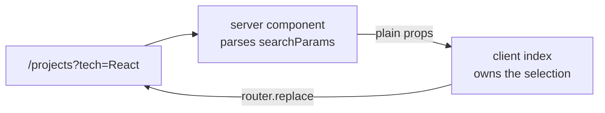
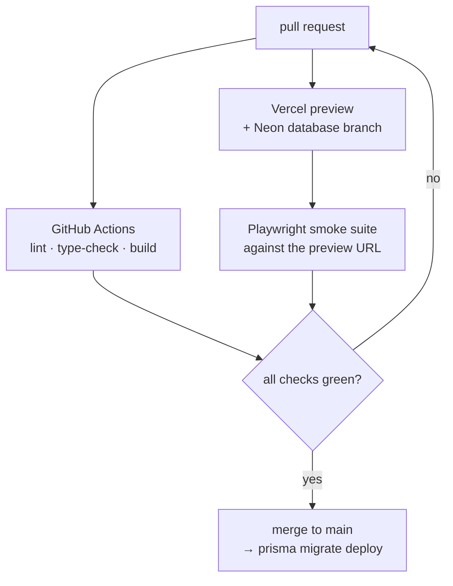

A personal site is text on a page. Almost none of it should need JavaScript to
look right. And yet the ordinary React patterns for theming, responsive
layout, and reading the URL all render _nothing_ on the server and then
rearrange the page once they hydrate. Most of the work here went into the
opposite property: the HTML that arrives is already the finished page.

## One source of truth for colour

No component names a colour. Everything resolves through CSS variables
(`--foreground`, `--background`, `--muted`, `--subtle`, `--line`) declared on
`:root` and overridden under `[data-theme="light"]`, exposed to Tailwind as
`text-foreground`, `border-line`, and so on.

Dark lives on bare `:root` rather than behind a media query, which is the part
that matters: the pre-JavaScript render is already the correct theme, and
`next-themes` only has to confirm or flip it. There is no first paint in the
wrong palette.

Light mode needed more than inverted values. A hairline border at 15% opacity
reads clearly on black and vanishes on white, so `--line-alpha` is itself
theme-aware (0.15 dark, 0.35 light). The navbar dims unhovered items to focus
the one you are pointing at. At 0.35 on black that is a subtle cue, and on
white it makes the text unreadable, so `--nav-dim` shifts to 0.78. Both are
tokens rather than component overrides, so nothing drifts.

Project previews extend the same idea to images. A project with its own light
and dark screenshots ships both, and the page renders both, with one hidden by
a CSS class the theme attribute controls. Picking in JavaScript would mean
either guessing on the server or rendering nothing until hydration, and this
does neither. Because `display: none` also removes an element from the
accessibility tree, the two images can carry identical alt text and exactly one
gets announced.

## What breaks before hydration

Four bugs, all the same shape: a browser-only hook forcing a second, different
render:

**`useMediaQuery` returns `false` on the server.** The `/random` canvas uses it
to pick between a stacked mobile list and a draggable desktop canvas, so a
phone received the desktop branch first. That branch had a `w-screen` child,
which pushed the layout column's minimum width past its own side margins, and
the entire page visibly jumped inward when hydration corrected the branch. The
fix was not to fix the hook but to make the wrong answer harmless: all
desktop-only geometry is scoped behind `sm:`, so the branch is dimensionally
inert when it renders on a small screen.

**The navbar returned `null` until mounted.** A reasonable-looking guard, since
the theme icon genuinely cannot be known server-side. It also meant the header
was absent from the initial HTML and appeared a beat later. Now the header
always renders and only the icon is gated, behind a placeholder of exactly the
same size.

**`useSearchParams` opts its subtree into streaming.** The projects page read
the technology filter from the URL with it, so the initial HTML shipped with
that whole region empty and the footer sat mid-viewport until the payload
arrived. The page is a server component that already receives `searchParams`, so
parsing there and passing plain props down removed both the boundary and the
jump.

**Measuring in `useEffect` paints first, measures second.** The scattered card
positions on `/random` are computed from the container's real size, which
briefly rendered a loading state on every visit. Moving it to a layout effect
closed the gap, and the loader now fades in only after 400ms, so on any normal
connection it never appears at all.

## Content as files

Blog posts and these project writeups are markdown with frontmatter, parsed
with `gray-matter` and rendered through one component. Publishing is adding a
file.

The projects were not always like this. They began as an array of objects in a
TypeScript file, rendered through a tabbed component, which meant every new
project was a code change and every writeup was a string literal with `\n` in
it. Moving them to `content/projects/*.md` made the filename the URL slug and
pushed the rest into frontmatter: `order` sorts the index, `featured` promotes
an entry onto the home page grid and fixes its position there, and `draft: true`
keeps an entry visible in development while stripping it from production
builds, so unfinished writing lives in the repo rather than on a branch. Slugs
are validated against an allowlist before touching the filesystem, since they
arrive from the URL.

The payoff is that prose gets the same tools as code. The same renderer powers
mermaid diagrams and KaTeX math, so a pipeline can be drawn instead of
described and a scoring rule can be written as an equation. The diagram below
is a fenced block in this file, re-rendered when you flip the theme.

## Filtering without giving up the server

The projects index filters by technology, and the filter lives in the URL so a
filtered view can be linked. That splits awkwardly across the server and client
boundary: the server knows the query string on the first request, and only the
browser knows about the click that comes next.

The server component parses the query and hands down plain props, so the first
paint is already filtered with no loading state and no streaming boundary. The
client component owns the interaction from there and writes the selection back
with a replace rather than a push, which keeps the back button pointed at the
page you arrived from instead of at every filter you tried. Technology badges
on a project page are links into that same filtered index, so the two routes
agree on one query format.

Badges resolve their logos through a registry keyed by technology name. A name
with no entry falls back to a generic glyph rather than rendering nothing, so
adding a project that uses something new is never blocked on adding an icon
first.

## Shipping it

`main` is protected, so this is the only path. Each preview gets its own
copy-on-write Neon branch and Clerk's development instance, which means the
smoke suite can exercise the guestbook without touching production data or
minting real sessions.

## Where it stops

There is no search and no RSS feed. Both are worth adding once there is enough
writing to justify them. The guestbook allows one comment per user, enforced by
a unique constraint on the Clerk user ID, with no editing or deletion; it is an
easter egg, not a comment system. Mermaid is a ~3MB dependency, dynamically
imported so it never enters the initial bundle, but any page carrying a diagram
still pays for the library. The technology filter is single-select, so there is
no way to ask for the intersection of two. And preview images are still
produced by hand at 1200×630 rather than generated per page at request time.
