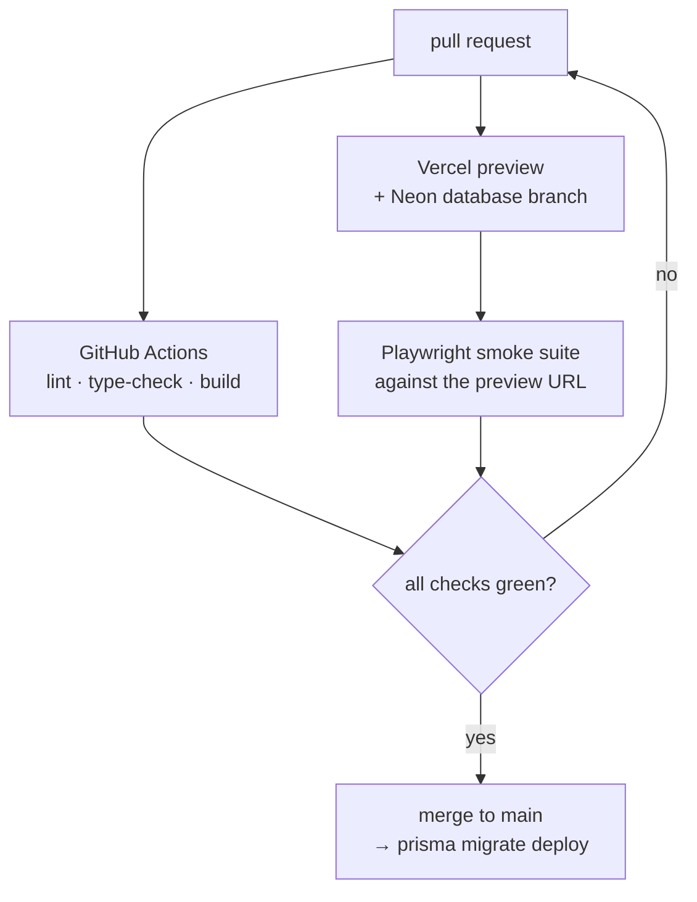

A personal site is text on a page. Almost none of it should need JavaScript to
look right. And yet the ordinary React patterns for theming, responsive
layout, and reading the URL all render _nothing_ on the server and then
rearrange the page once they hydrate. Most of the work here went into the
opposite property: the HTML that arrives is already the finished page.

## One source of truth for colour

No component names a colour. Everything resolves through CSS variables
(`--foreground`, `--background`, `--muted`, `--subtle`, `--line`) declared on
`:root` and overridden under `[data-theme="light"]`, exposed to Tailwind as
`text-foreground`, `border-line`, and so on.

Dark lives on bare `:root` rather than behind a media query, which is the part
that matters: the pre-JavaScript render is already the correct theme, and
`next-themes` only has to confirm or flip it. There is no first paint in the
wrong palette.

Light mode needed more than inverted values. A hairline border at 15% opacity
reads clearly on black and vanishes on white, so `--line-alpha` is itself
theme-aware (0.15 dark, 0.35 light). The navbar dims unhovered items to focus
the one you are pointing at. At 0.35 on black that is a subtle cue, and on
white it makes the text unreadable, so `--nav-dim` shifts to 0.78. Both are
tokens rather than component overrides, so nothing drifts.

## What breaks before hydration

Four bugs, all the same shape: a browser-only hook forcing a second, different
render:

**`useMediaQuery` returns `false` on the server.** The `/random` canvas uses it
to pick between a stacked mobile list and a draggable desktop canvas, so a
phone received the desktop branch first. That branch had a `w-screen` child,
which pushed the layout column's minimum width past its own side margins, and
the entire page visibly jumped inward when hydration corrected the branch. The
fix was not to fix the hook but to make the wrong answer harmless: all
desktop-only geometry is scoped behind `sm:`, so the branch is dimensionally
inert when it renders on a small screen.

**The navbar returned `null` until mounted.** A reasonable-looking guard, since
the theme icon genuinely cannot be known server-side. It also meant the header
was absent from the initial HTML and appeared a beat later. Now the header
always renders and only the icon is gated, behind a placeholder of exactly the
same size.

**`useSearchParams` opts its subtree into streaming.** The project page read
the technology filter from the URL with it, so the initial HTML shipped with
that whole region empty and the footer sat mid-viewport until the payload
arrived. The page is a server component that already receives `searchParams`, so
parsing there and passing plain props down removed both the boundary and the
jump.

**Measuring in `useEffect` paints first, measures second.** The scattered card
positions on `/random` are computed from the container's real size, which
briefly rendered a loading state on every visit. Moving it to a layout effect
closed the gap, and the loader now fades in only after 400ms, so on any normal
connection it never appears at all.

## Content as files

Blog posts and these project writeups are markdown with frontmatter, parsed
with `gray-matter` and rendered through one component. Publishing is adding a
file. `draft: true` keeps an entry visible in development and strips it from
production builds, so unfinished writing lives in the repo rather than a branch.
Slugs are validated against an allowlist before touching the filesystem, since
they arrive from the URL.

The same renderer powers mermaid diagrams and KaTeX math. The diagram below is
a fenced block in this file, re-rendered when you flip the theme.

## Shipping it

`main` is protected, so this is the only path. Each preview gets its own
copy-on-write Neon branch and Clerk's development instance, which means the
smoke suite can exercise the guestbook without touching production data or
minting real sessions.

## Where it stops

There is no search and no RSS feed. Both are worth adding once there is enough
writing to justify them. The guestbook allows one comment per user, enforced by
a unique constraint on the Clerk user ID, with no editing or deletion; it is an
easter egg, not a comment system. Mermaid is a ~3MB dependency, dynamically
imported so it never enters the initial bundle, but any page carrying a diagram
still pays for the library. And preview images are still produced by hand at
1200×630 rather than generated per page at request time.
