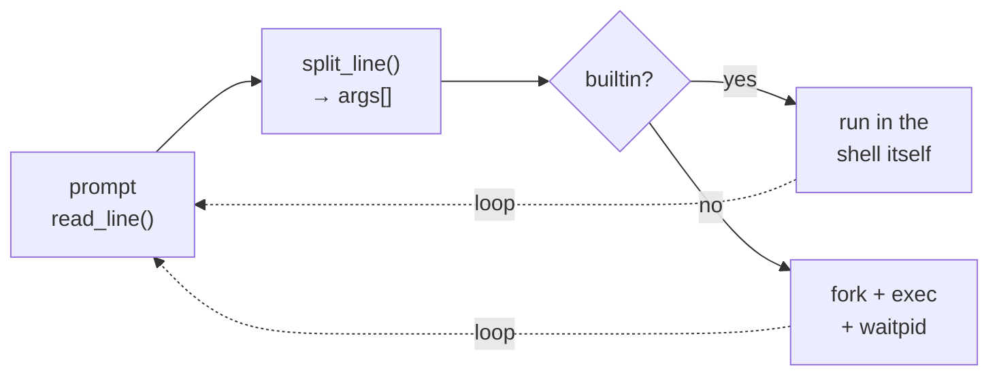
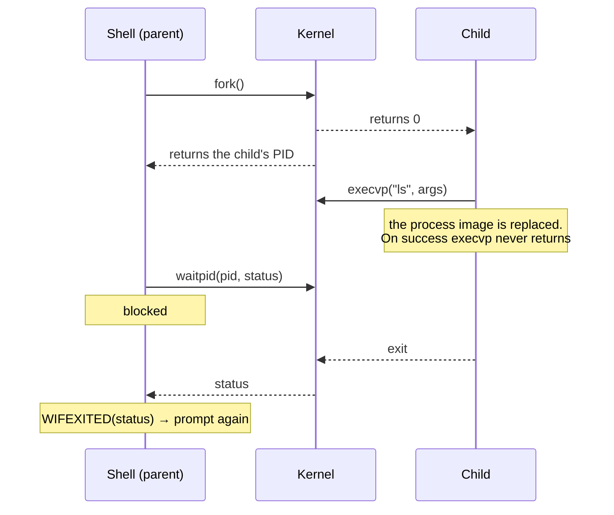
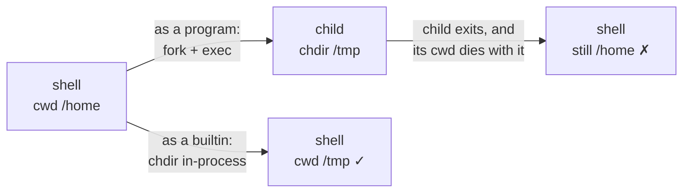

Every terminal session you've ever used runs the same loop: print a prompt, read a line, split it into words, turn those words into a running process, wait, repeat. I wrote this shell in C to see that loop with nothing on top of it: about 320 lines, no libraries beyond libc.

## The loop

Each pass frees both allocations and checks a status code: `1` keeps looping, `0` means `exit` ran. `read_line()` grows a buffer with `realloc` as it reads characters, then `split_line()` runs `strtok` over it to produce the `args` array. One detail took me a while to appreciate: `strtok` doesn't copy anything. It writes null bytes into the original line and hands back pointers into that same buffer, which is why `args` doesn't own its strings, and why both frees have to happen together at the bottom of the loop.

## fork, exec, wait

This is the part you can't learn by reading a real shell's source, because it's buried under too much else. Here it's about 35 lines.

`fork()` is the strange one. It returns _twice_, zero in the child and the child's PID in the parent, and that single return value is the only thing telling two now-identical processes which one they are. `execvp` then overwrites the child's process image entirely, which is why a return from it always means failure.

## Why `cd` can't be a program

The best thing this project taught me, and it falls straight out of the diagram above.

A child process gets a _copy_ of the working directory. Change it and the change dies when the child exits. So `cd` has to run inside the shell itself, and the same goes for `exit`, and for anything else that mutates shell state. That's the whole reason builtins exist, and it's why the dispatch table gets checked _before_ `fork` is ever called. The table is a pair of parallel arrays, `builtin_str[]` of names next to `builtin_func[]` of function pointers, which is how C does this without objects.

## Where it stops

Commands are split on whitespace and nothing else, and that one decision sets the ceiling. Quoting, `$VAR`, globbing, pipes and redirection all need a real tokenizer that tracks quote state, feeding a grammar that builds a tree of pipelines and redirections, not `strtok`. Interactive handling stops early too: Ctrl-C reaches the shell instead of only the child, because the child is never put in its own process group.

Both are the natural next version. The fork/exec core underneath wouldn't have to change.

## Background

Built from Stephen Brennan's [lsh walkthrough](https://brennan.io/2015/01/16/write-a-shell-in-c/), then extended with a `history` builtin and split into per-builtin translation units behind a shared header, so adding a command means adding a file rather than editing one.
